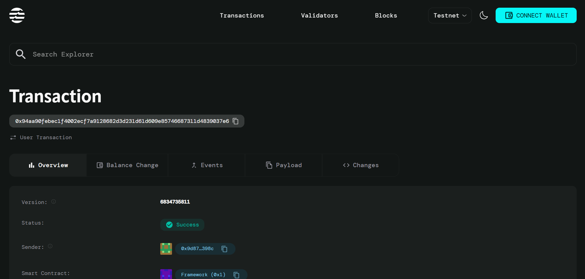

# Migration Assistant

## Project Description

Migration Assistant is a smart contract built on the Aptos blockchain that provides essential tools for migrating data between different contract versions. As blockchain applications evolve, developers often need to upgrade their smart contracts while preserving existing user data and state. This contract offers a secure, transparent, and efficient way to handle version migrations with proper verification and tracking mechanisms.

## Project Vision

Our vision is to create a standardized, reliable infrastructure for smart contract migrations on the Aptos ecosystem. We aim to eliminate the complexity and risks associated with contract upgrades by providing developers with battle-tested migration tools that ensure data integrity, maintain user trust, and enable seamless transitions between contract versions.

## Key Features

### 🔧 **Migration Management**
- **Version Tracking**: Comprehensive tracking of source and target contract versions
- **Data Integrity**: Hash-based verification system to ensure data consistency during migration
- **Timestamp Recording**: Complete audit trail with migration timestamps
- **Status Verification**: Built-in verification flags to confirm successful migrations

### 🛡️ **Security & Access Control**
- **Owner Authorization**: Only contract owners can initiate migrations
- **Version Validation**: Prevents invalid migrations (e.g., backwards migration)
- **Error Handling**: Robust error codes for different failure scenarios
- **State Verification**: Ensures migration tools are properly initialized

### 📊 **Analytics & Monitoring**
- **Migration Counter**: Track total number of migrations performed
- **Version History**: Maintain list of all supported contract versions
- **Migration Records**: Permanent on-chain records of all migration activities
- **Verification Status**: Real-time status of migration completion

### ⚡ **Developer-Friendly**
- **Simple API**: Easy-to-use functions for common migration tasks
- **Modular Design**: Clean separation of concerns for maintainability
- **Gas Optimized**: Efficient implementation within Aptos transaction limits
- **Standards Compliant**: Follows Aptos Move best practices

## Future Scope

### Phase 1: Enhanced Migration Tools
- **Batch Migration**: Support for migrating multiple data entries in a single transaction
- **Rollback Mechanism**: Safe rollback functionality for failed migrations
- **Cross-Contract Migration**: Tools for migrating data between different contract addresses
- **Migration Templates**: Pre-built templates for common migration patterns

### Phase 2: Advanced Features
- **Automated Migration**: Smart triggers for automatic version upgrades
- **Migration Scheduling**: Time-based migration execution
- **Multi-Signature Support**: Require multiple approvals for critical migrations
- **Migration Governance**: Community voting mechanisms for public contract upgrades

### Phase 3: Ecosystem Integration
- **Migration Marketplace**: Platform for sharing migration strategies
- **Integration APIs**: REST APIs for off-chain migration monitoring
- **Development Tools**: VS Code extensions and CLI tools for developers
- **Analytics Dashboard**: Web interface for migration analytics and monitoring

### Phase 4: Enterprise Features
- **Enterprise SLA**: Guaranteed migration performance for business applications
- **Custom Migration Logic**: Support for complex, domain-specific migration requirements
- **Compliance Tools**: Built-in compliance checking for regulatory requirements
- **Professional Support**: Dedicated support channels for enterprise users

## Contract Details
0x94aa90febec1f4002ecf7a9128682d3d231d61d609e85746687311d4839037e6

### Prerequisites
- Aptos CLI installed and configured
- Move compiler v1.0 or higher
- Aptos account with sufficient APT for gas fees

### Installation & Deployment
```bash
# Clone the repository
git clone <repository-url>
cd migration-assistant

# Initialize Aptos environment
aptos init

# Compile the contract
aptos move compile

# Deploy to testnet
aptos move publish --named-addresses MigrationAssistant=<your-address>
```

### Usage Example
```move
// Initialize migration tools
MigrationAssistant::DataMigrator::initialize_migration_tools(&owner_signer);

// Migrate data from version 1 to version 2
let data_hash = b"hash_of_migrated_data";
MigrationAssistant::DataMigrator::migrate_data(
    &owner_signer, 
    1, 
    2, 
    data_hash
);
```

### Error Codes
- `E_NOT_AUTHORIZED (1)`: Caller is not authorized to perform migration
- `E_MIGRATION_ALREADY_EXISTS (2)`: Migration tools already initialized
- `E_INVALID_VERSION (3)`: Invalid version numbers provided

---

**License**: MIT License  
**Maintainers**: Aptos Development Team  
**Last Updated**: August 2025